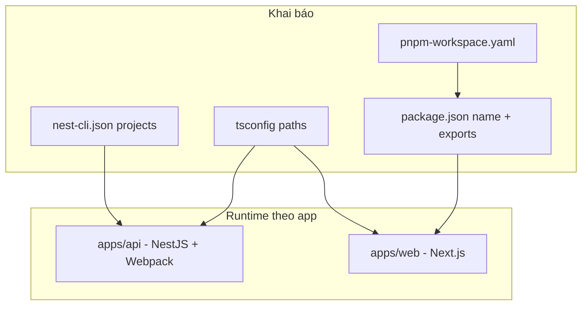

# Phân tích @packages/ module
_Exported on 5/27/2026 at 09:41:46 GMT+7 from Cursor (3.5.33)_

---

**User**

phân tích cách khai báo và cách hoạt động của @packages/ 

---

**Cursor**

Đang phân tích cấu trúc monorepo và cách khai báo alias `@packages/`.


## Lưu ý quan trọng

Trong repo này **không có alias `@packages/`**. Thư mục vật lý là `packages/`, nhưng khi import code dùng **2 namespace**:

| Namespace | Dùng cho | Ví dụ |
|-----------|----------|-------|
| `@ac/*` | Thư viện backend (NestJS) | `@ac/models`, `@ac/common` |
| `@workspace/*` | UI, shared DTO, config, permissions | `@workspace/ui`, `@workspace/shared` |

---

## 1. Khai báo monorepo

### pnpm workspace

```1:3:pnpm-workspace.yaml
packages:
  - "apps/*"
  - "packages/*"
```

Mọi thư mục con trong `apps/` và `packages/` đều là package trong workspace. pnpm liên kết chúng qua protocol `workspace:*`.

### Turbo (orchestration)

```1:18:turbo.json
{
  "$schema": "https://turbo.build/schema.json",
  "ui": "stream",
  "tasks": {
    "build": {
      "cache": false,
      "dependsOn": ["^build"],
      "outputs": ["dist/**" ]
    },
    ...
  }
}
```

`dependsOn: ["^build"]` nghĩa là build app sẽ build dependency trước.

---

## 2. Danh sách packages và cách khai báo

```
packages/
├── api-common/      → @ac/common / @ac/api-common   (NestJS library, không có package.json)
├── api-i18n/        → @ac/i18n / @ac/api-i18n       (NestJS library, không có package.json)
├── api-utils/       → @ac/utils / @ac/api-utils     (NestJS library, không có package.json)
├── api-models/      → @ac/models / @ac/api-models   (có package.json)
├── api-queue/       → @ac/api-queue                 (có package.json)
├── shared/          → @workspace/shared
├── ui/              → @workspace/ui
├── permissions/     → @workspace/permissions
├── eslint-config/   → @workspace/eslint-config
└── typescript-config/ → @workspace/typescript-config
```

### Hai kiểu package

**A. Package có `package.json` + tên npm scope**

Ví dụ `@workspace/ui`:

```1:15:packages/ui/package.json
{
  "name": "@workspace/ui",
  "version": "0.0.0",
  "private": true,
  "type": "module",
  "exports": {
    "./globals.css": "./src/styles/globals.css",
    "./components/*": "./src/components/*.tsx",
    "./hooks/*": "./src/hooks/*.ts",
    "./mi/*": "./src/mi/*.tsx",
    ...
  },
```

App khai báo dependency:

```json
"@workspace/ui": "workspace:*"
```

**B. NestJS library không có `package.json` riêng**

`api-common`, `api-i18n`, `api-utils` chỉ được đăng ký trong `nest-cli.json`:

```34:68:nest-cli.json
    "common": {
      "type": "library",
      "root": "packages/api-common",
      "entryFile": "index",
      "sourceRoot": "packages/api-common/src",
      ...
    },
    "i18n": { ... },
    "models": { ... },
    "utils": { ... },
    "api-queue": { ... }
```

Prefix mặc định: `"defaultLibraryPrefix": "@ac"`.

---

## 3. Cơ chế resolve import (3 lớp)



### Lớp 1: TypeScript path aliases

Root `tsconfig.json`:

```17:36:tsconfig.json
    "paths": {
      "@ac/api-common": ["packages/api-common/src"],
      "@ac/api-common/*": ["packages/api-common/src/*"],
      "@ac/common": ["packages/api-common/src"],
      ...
      "@ac/api-models": ["packages/api-models/src"],
      "@workspace/permissions": ["packages/permissions/src"],
      ...
    },
```

Mỗi app **extends** và override thêm paths:

- `apps/api/tsconfig.json` — đầy đủ `@ac/*` + `@workspace/shared`
- `apps/web/tsconfig.json` — thêm `@workspace/ui/*`, `@ac/api-models`, alias `@/app/*`...

→ TypeScript hiểu import, IDE autocomplete hoạt động.

### Lớp 2: pnpm workspace linking

Chỉ package **có tên trong `package.json`** mới được symlink vào `node_modules`:

```
node_modules/@workspace/ui → packages/ui
node_modules/@workspace/eslint-config → packages/eslint-config
```

`@ac/*` **không** có trong `node_modules` — resolve trực tiếp qua tsconfig paths (và webpack bundle source).

### Lớp 3: Bundler / framework

**Backend (`apps/api`)**

- NestJS monorepo + webpack
- Import trực tiếp source TypeScript từ `packages/` qua paths
- Output: `dist/apps/api`

**Frontend (`apps/web`)**

```69:69:apps/web/next.config.mjs
  transpilePackages: ['@workspace/ui', '@workspace/shared', '@workspace/permissions'],
```

Next.js transpile workspace packages (vì chúng là TS/TSX source, không phải pre-built JS).

`@ac/api-models` được import qua tsconfig paths (types, entity) — **không** cần `transpilePackages` vì chủ yếu dùng type/constants.

---

## 4. Cách hoạt động theo từng package

### `@workspace/ui` — component library (source-first)

- **Không build** (`"build": "echo UI package is library - no build needed"`)
- Export theo subpath: `@workspace/ui/components/button`, `@workspace/ui/mi/table`
- Import trực tiếp file `.tsx` trong `packages/ui/src/`
- Next.js transpile khi bundle

```typescript
import { Button } from "@workspace/ui/components/button";
import { DataTable } from "@workspace/ui/mi/table";
```

### `@workspace/shared` — DTO dùng chung FE/BE

- **Có build** (`tsc` → `dist/`)
- Export: `@workspace/shared`, `@workspace/shared/dto`
- Dùng cho DTO validation (class-validator) chia sẻ giữa web và api

```typescript
import { CreateVeCoBanDto } from "@workspace/shared";
```

### `@ac/models` / `@ac/api-models` — Entity, repository, TypeORM

- Entity TypeORM, repository, `DatabaseModule`
- API import đầy đủ runtime
- Web chủ yếu import **types**:

```typescript
import { BookingTrangThai } from "@ac/api-models/types";
```

### `@ac/common` — DTO, interceptor, pipe, helper NestJS

```typescript
import { ... } from "@ac/common";
import { GoiVeChiTiet } from "@ac/models";
```

### `@workspace/permissions` — định nghĩa quyền

Export trực tiếp source TS (không build):

```json
"main": "src/index.ts"
```

---

## 5. Alias song song (legacy / tiện dùng)

Một số package có **2 tên** trỏ cùng source:

| Alias ngắn | Alias đầy đủ | Package |
|------------|--------------|---------|
| `@ac/common` | `@ac/api-common` | api-common |
| `@ac/models` | `@ac/api-models` | api-models |
| `@ac/utils` | `@ac/api-utils` | api-utils |
| `@ac/i18n` | `@ac/api-i18n` | api-i18n |

Code hiện tại dùng cả hai (ví dụ `@ac/common` và `@ac/models` trong API).

---

## 6. Luồng dev/build thực tế

```
pnpm dev
  └── turbo run dev --parallel
        ├── apps/web: next dev
        │     └── resolve @workspace/ui qua node_modules symlink + transpilePackages
        │     └── resolve @ac/api-models qua tsconfig paths (types)
        └── apps/api: nest start --watch
              └── webpack bundle source từ packages/api-* qua tsconfig paths
```

Build production:

```
pnpm build
  └── turbo run build
        ├── @workspace/shared: tsc → dist/
        ├── @ac/api-queue: tsc → dist/
        ├── apps/web: next build (standalone)
        └── apps/api: nest build → dist/apps/api
```

---

## 7. Tóm tắt

| Câu hỏi | Trả lời |
|---------|---------|
| `@packages/` là gì? | **Không tồn tại** — dùng `@ac/*` hoặc `@workspace/*` |
| Thư mục `packages/` khai báo ở đâu? | `pnpm-workspace.yaml` + `nest-cli.json` (API libs) |
| Import resolve thế nào? | tsconfig `paths` + (tuỳ app) pnpm symlink + bundler |
| Package nào cần build? | `shared`, `api-queue` có build; `ui`, `permissions` dùng source trực tiếp |
| Web dùng package backend? | Chủ yếu **types/DTO** từ `@ac/api-models`, `@workspace/shared` |

Nếu bạn muốn thêm package mới, hướng đi thường là:
1. Tạo thư mục trong `packages/`
2. Thêm `package.json` với tên `@workspace/...` hoặc `@ac/...`
3. Khai báo `paths` trong `tsconfig.json` (root + app)
4. Với NestJS lib: thêm entry trong `nest-cli.json`
5. Với Next.js: thêm vào `transpilePackages` nếu cần

Bạn muốn đi sâu vào package cụ thể nào (ví dụ `ui`, `api-models`, hay cách thêm package mới)?

